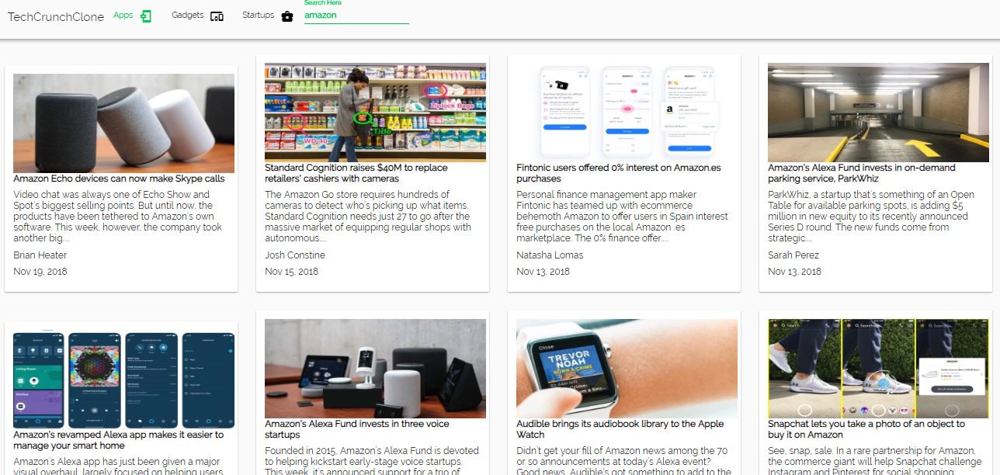

# T E C H C R U N C H    C L O N E

> Scrapes https://www.techcrunch.com to give live news related to apps ,gadgets ,and startups.Performs search based on keywords specified


## Getting Started

These instructions will get you a copy of the project up and running on your local machine for development and testing purposes. See deployment for notes on how to deploy the project on a live system.

### Prerequisites

Node version- ^v8.12.0
Python verison- 3.6
Angular CLI

```
Give examples
```

### Installing

Clone/Download the project and run "npm install"->ng serve -o


### Demo




## Authors

* **Paul Braganza** - *Initial work* - [PurpleBooth](https://github.com/paulbraganza12)

## License

This project is licensed
